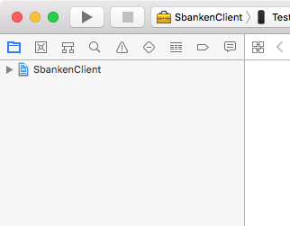
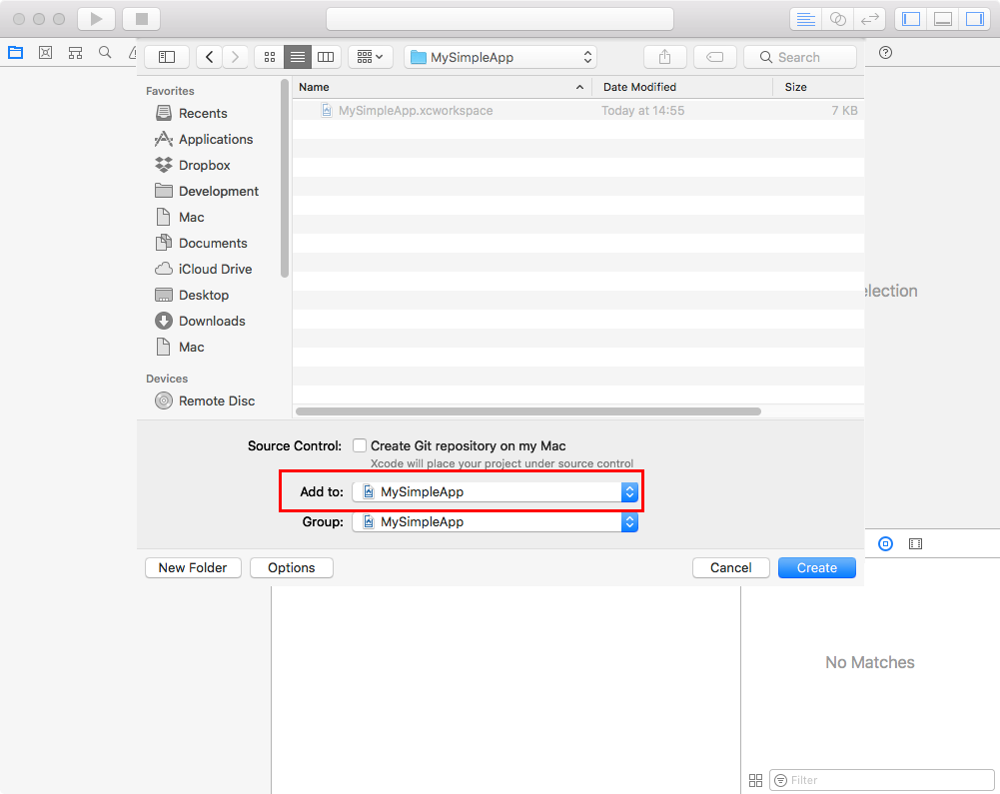
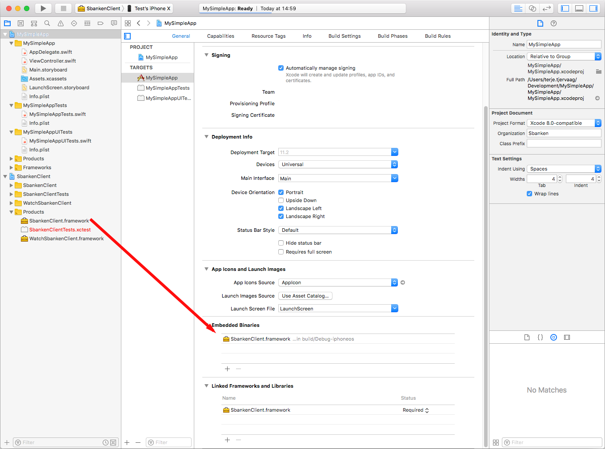

# SbankenClient.framework

An iOS framework to use the [Sbanken API](https://sbanken.no/bruke/utviklerportalen/).

The framework is offered as an example of API usage from Swift, as well
as a tool for quickly being able to create working iOS prototypes using
the API.

## Installation

### Using Carthage

The easiest way to get up and running is to add the framework using the
dependency manager [Carthage](https://github.com/Carthage/Carthage).

Add the following to your [Cartfile](https://github.com/Carthage/Carthage/blob/master/Documentation/Artifacts.md#cartfile):

    github "Sbanken/sbankenclient-ios"

Add `$(SRCROOT)/Carthage/Build/iOS/SbankenClient.framework` to the
Input Files of your Carthage copy-frameworks build step as well as
`$(BUILT_PRODUCTS_DIR)/$(FRAMEWORKS_FOLDER_PATH)/Reachability.framework`
to the Output Files.

### Manual installation

This describes setting up a new simple app and including
SbankenClient.framework.

Clone this repository.

Create a new Workspace in Xcode (`File -> New -> Workspace...`).

Drag `SbankenClient.xcodeproj` into the left hand navigator of your new
workspace:

Add a new app project to your workspace by navigating to `File -> New ->
Project...`, selecting for instance a *Single View App*. Name your
project, and in the file dialog, make sure your new app is added to your
workspace:

Lastly, select your new app project inside your workspace and drag
`SbankenClient.framework` into the `Embedded Binaries` area of the
project info view:

## Usage

Run a build of your Xcode project or workspace before attempting to use
the framework, and remember to `import SbankenClient` in every Swift
file you want to use the client from.

Create a new client by using your Client ID and Secret:

    let client = SbankenClient(clientId: "MY-CLIENT-ID", secret: "MY-SECRET")

(Sign up for [API access](https://sbanken.no/bruke/utviklerportalen/) if
you don't have these)

Let this client object live for as long as possible. It will handle
caching of the access token.

### Getting accounts

    client.accounts(userId: "[ELEVEN-DIGIT-ID]", success: { accounts in
        let acccountName = accounts.first?.name
        let availableAmount = accounts.first?.available
    }) { _ in
        print "An error occurred"
    }

### Getting transactions from an account

    let oneWeekAgo = Calendar.current.date(byAdding: .day, value: -7, to: Date())!
    client.transactions(userId: "[ELEVEN-DIGIT-ID]", accountNumber: "[ACCOUNT-NUMBER]",
                        startDate: oneWeekAgo, endDate: Date(),
                        success: { response in
        let accountNumber = response.items.first?.accountNumber
        let amount = response.items.first?.amount
    }, failure: { _ in
        print("An error occurred")
    })

### Transferring an amount between two accounts within Sbanken

    client.transfer(userId: "[ELEVEN-DIGIT-ID]", fromAccount: "[ACCOUNT-NUMBER]", toAccount: "[ACCOUNT-NUMBER]",
                    message: "Here, have some money", amount: 100.0,
                    success: { response in
                        if (!response.isError) {
                            print("Transfer successful")
                        }
    }, failure: { _ in
        print("An error occurred")
    })

## License

The MIT License

Permission is hereby granted, free of charge, to any person obtaining a copy of this software and associated documentation files (the "Software"), to deal in the Software without restriction, including without limitation the rights to use, copy, modify, merge, publish, distribute, sublicense, and/or sell copies of the Software, and to permit persons to whom the Software is furnished to do so, subject to the following conditions:

The above copyright notice and this permission notice shall be included in all copies or substantial portions of the Software.

THE SOFTWARE IS PROVIDED "AS IS", WITHOUT WARRANTY OF ANY KIND, EXPRESS OR IMPLIED, INCLUDING BUT NOT LIMITED TO THE WARRANTIES OF MERCHANTABILITY, FITNESS FOR A PARTICULAR PURPOSE AND NONINFRINGEMENT. IN NO EVENT SHALL THE AUTHORS OR COPYRIGHT HOLDERS BE LIABLE FOR ANY CLAIM, DAMAGES OR OTHER LIABILITY, WHETHER IN AN ACTION OF CONTRACT, TORT OR OTHERWISE, ARISING FROM, OUT OF OR IN CONNECTION WITH THE SOFTWARE OR THE USE OR OTHER DEALINGS IN THE SOFTWARE.
